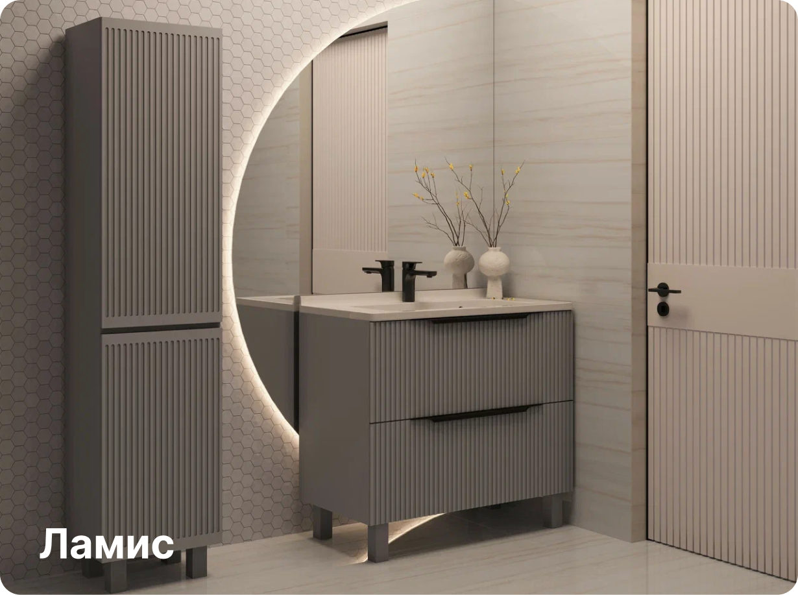
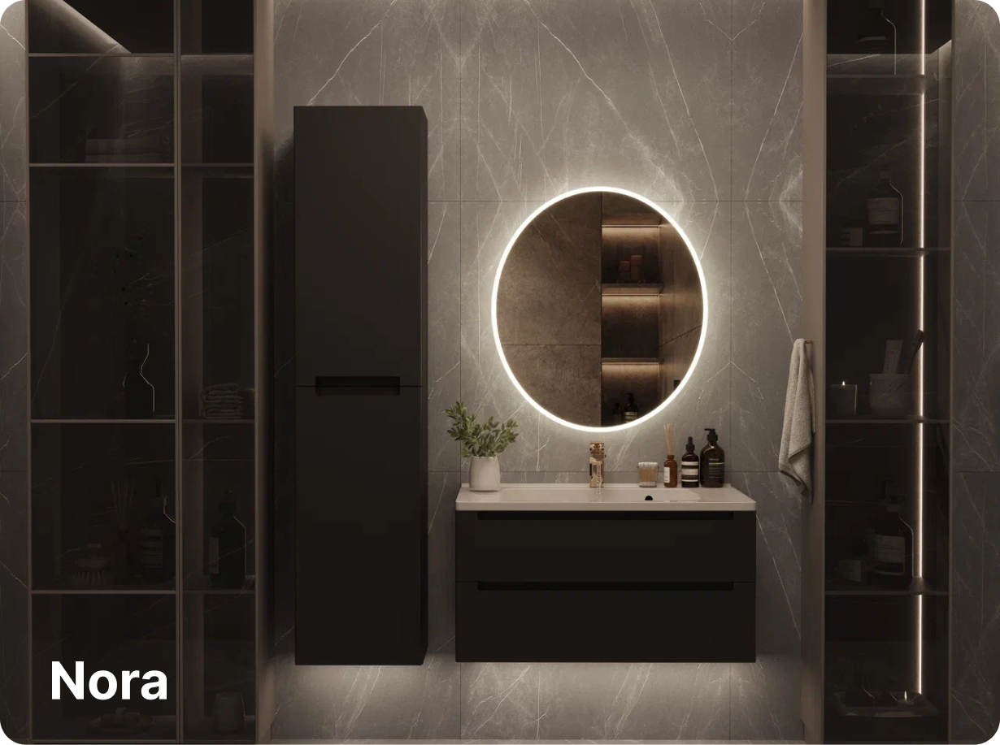
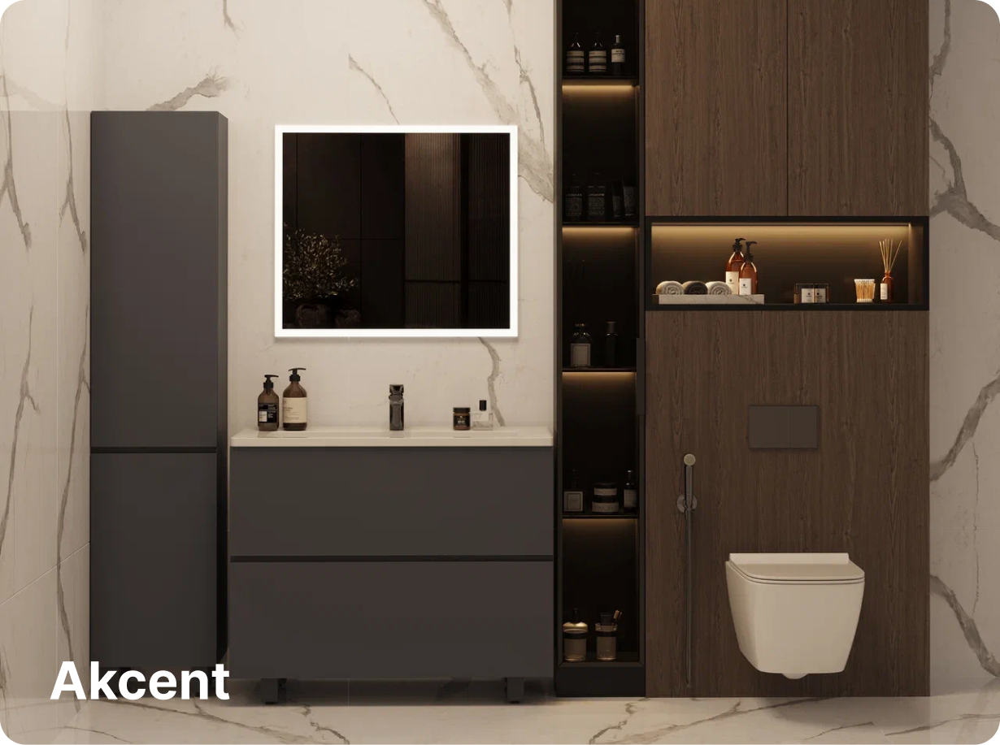

# Коллекции мебели для ванн LAMIS - Complete Specification

## Section Overview

This is the Collections section located at y=1300px in the Figma design.

---

## 1. SECTION TITLE

### Text Content

**"Коллекции мебели для ванн LAMIS"**

### Position

- **X**: 335px
- **Y**: 1300px
- **Width**: 420px
- **Height**: 112px

### Typography

- **Font Family**: Inter
- **Font Size**: 43.3px (43.29999923706055px)
- **Font Weight**: 700 (Bold)
- **Line Height**: 56px
- **Letter Spacing**: 0
- **Text Align**: LEFT
- **Color**: #1d1d1d (RGB: 29, 29, 29)

### Spacing

- **Margin Bottom**: ~140px (distance to first collection item at y=1452px)

---

## 2. COLLECTIONS GRID LAYOUT

### Container Specifications

- **Type**: Frame 7 (id: 1:4167)
- **Position**:
  - X: 335px
  - Y: 1452px (152px below title)
- **Dimensions**:
  - Width: 1250px
  - Height: 936.64px

### Grid Structure

- **Layout Mode**: HORIZONTAL (Flexbox row)
- **Item Spacing**: 20px (gap between cards)
- **Grid Pattern**: 2x2 grid
  - Row 1: 2 items (Ламис, Nora)
  - Row 2: 2 items (Akcent, Andalusia)
- **Row Spacing**: ~478.32px (calculated from positions)

### Grid Calculations

- **Card Width**: 615px
- **Card Height**: 458.32px
- **Horizontal Gap**: 20px
- **Vertical Gap**: ~20px
- **Total Columns**: 2
- **Total Rows**: 2

---

## 3. COLLECTION CARD SPECIFICATIONS

### Card Dimensions

- **Width**: 615px
- **Height**: 458.32px (458.3192138671875px)
- **Aspect Ratio**: ~1.34:1 (landscape)

### Card Styling

- **Border Radius**: 16px
- **Padding**:
  - Top: 20px
  - Bottom: 20px
  - Left: 30px
  - Right: 30px

### Card Layout

- **Layout Mode**: HORIZONTAL
- **Item Spacing**: 10px
- **Content Alignment**: MAX (items aligned to bottom)

### Card Background

Each card has multiple layers:

1. **Solid Color Background** (fallback):
   - Varies per card (#d9d9d9, #f1f1f1, etc.)
2. **Background Image** (main product image)
   - Scale Mode: FILL or STRETCH
3. **Optional Gradient Overlay** (not explicitly defined, may need inspection)

---

## 4. INDIVIDUAL COLLECTION CARDS

### Card 1: Ламис

**Position**: Top-left (335px, 1452px)

**Background Layers**:

1. Solid color: #d9d9d9 (RGB: 217, 217, 217)
2. Image: `5065076cb222575d61ba7fe8a0c1859a2440534b` (FILL)
3. Overlay image: `16d4d5bd0ae4f2a146ec2586f146646700bed66a` (STRETCH)

**Text Label**:

- Content: "Ламис"
- Position: Bottom-left (aligned with padding)
  - X: 365px (30px from card edge)
  - Y: 1851.32px
- Font: Inter, 700 (Bold)
- Size: 32px
- Line Height: 38.73px
- Color: #ffffff (white)
- Dimensions: 105px × 39px

**Downloaded Image**: `Item_14168.png`

---

### Card 2: Nora

**Position**: Top-right (970px, 1452px)

**Background Layers**:

1. Solid color: #f1f1f1 (RGB: 241, 241, 241)
2. Multiple images layered:
   - `59247c5659350b445a0a23a5adaee9586e638895` (FILL)
   - `5e10ab5489e3303d2b0986ea2e5b3181e66d2e4f` (FILL)
   - `1ee3db94cf429e820afa9f04b84437b5929812bc` (FILL)
   - `cd999cdd75aef7b6f409c165deaf534b98902768` (FILL)

**Text Label**:

- Content: "Nora"
- Position: Bottom-left
  - X: 1000px (30px from card edge)
  - Y: 1851.32px
- Font: Inter, 700 (Bold)
- Size: 32px
- Line Height: 38.73px
- Color: #ffffff (white)
- Dimensions: 75px × 39px

**Downloaded Image**: `Item_14169.png`

---

### Card 3: Akcent

**Position**: Bottom-left (335px, 1930.32px)

**Background Layers**:

1. Image: `96ad54204e8f242f85cafe13992389f89688d5c7` (STRETCH)
2. Overlay image: `d8179a00e58dba78bcbabfb95ed883fd11c19151` (STRETCH)

**Text Label**:

- Content: "Akcent"
- Position: Bottom-left
  - X: 365px (30px from card edge)
  - Y: 2329.64px
- Font: Inter, 700 (Bold)
- Size: 32px
- Line Height: 38.73px
- Color: #ffffff (white)
- Dimensions: 113px × 39px

**Downloaded Image**: `Item_14170.png`

---

### Card 4: Andalusia

**Position**: Bottom-right (970px, 1930.32px)

**Background Layers**:

1. Solid color: #f1f1f1 (RGB: 241, 241, 241)
2. Multiple images:
   - `5065076cb222575d61ba7fe8a0c1859a2440534b` (FILL)
   - `b1714816f75fb84cf7dd6ce1bee1b0aa6a5698da` (FILL)
   - `c5e5ef5d86287488a4a638a13190db60da2263bf` (FILL)

**Text Label**:

- Content: "Andalusia"
- Position: Bottom-left
  - X: 1000px (30px from card edge)
  - Y: 2329.64px
- Font: Inter, 700 (Bold)
- Size: 32px
- Line Height: 38.73px
- Color: #ffffff (white)
- Dimensions: 157px × 39px

**Downloaded Image**: `Item_14171.png`

---

## 5. RESPONSIVE BREAKPOINTS (Suggested)

### Desktop (1920px)

- Container: 1250px width
- Grid: 2 columns
- Gap: 20px

### Tablet (768px - 1024px)

- Container: ~700px width
- Grid: 2 columns (smaller cards)
- Gap: 16px
- Card size: ~340px × 255px

### Mobile (< 768px)

- Container: Full width minus padding
- Grid: 1 column
- Gap: 16px
- Card size: Full width × auto height

---

## 6. DOWNLOADED ASSETS

All collection images have been downloaded to:
**Directory**: `/Users/new/Desktop/Проекты/Lamis/e-commerce/public/collections/`

### Image Files:

1. **Item_14168.png** - Ламис collection (721 KB)
2. **Item_14169.png** - Nora collection (777 KB)
3. **Item_14170.png** - Akcent collection (659 KB)
4. **Item_14171.png** - Andalusia collection (1.2 MB)

All images are exported at 2x scale (Retina) in PNG format.

---

## 7. IMPLEMENTATION NOTES

### HTML Structure

```html
<section class="collections-section">
  <h2 class="collections-title">Коллекции мебели для ванн LAMIS</h2>
  <div class="collections-grid">
    <a href="#" class="collection-card">
      
      <span class="collection-name">Ламис</span>
    </a>
    <a href="#" class="collection-card">
      
      <span class="collection-name">Nora</span>
    </a>
    <a href="#" class="collection-card">
      
      <span class="collection-name">Akcent</span>
    </a>
    <a href="#" class="collection-card">
      
      <span class="collection-name">Andalusia</span>
    </a>
  </div>
</section>
```

### CSS/Tailwind Styling

```css
.collections-section {
  padding: 0 335px; /* Align with design */
  margin-top: 1300px; /* Or relative positioning */
}

.collections-title {
  font-family: 'Inter', sans-serif;
  font-size: 43.3px;
  font-weight: 700;
  line-height: 56px;
  color: #1d1d1d;
  margin-bottom: 140px;
}

.collections-grid {
  display: grid;
  grid-template-columns: repeat(2, 615px);
  gap: 20px;
  width: 1250px;
}

.collection-card {
  width: 615px;
  height: 458.32px;
  border-radius: 16px;
  position: relative;
  overflow: hidden;
  display: flex;
  align-items: flex-end;
  padding: 20px 30px;
}

.collection-card img {
  position: absolute;
  top: 0;
  left: 0;
  width: 100%;
  height: 100%;
  object-fit: cover;
  z-index: 1;
}

.collection-name {
  font-family: 'Inter', sans-serif;
  font-size: 32px;
  font-weight: 700;
  line-height: 38.73px;
  color: #ffffff;
  position: relative;
  z-index: 2;
}
```

### Tailwind Classes

```
Section Title: text-[43.3px] font-bold leading-[56px] text-[#1d1d1d]
Grid: grid grid-cols-2 gap-5 w-[1250px]
Card: w-[615px] h-[458.32px] rounded-2xl relative overflow-hidden flex items-end p-[20px_30px]
Card Name: text-[32px] font-bold leading-[38.73px] text-white z-10
```

---

## 8. ADDITIONAL CONSIDERATIONS

### Text Overlay / Gradient

The design likely has a gradient overlay on the images to ensure text readability. Consider adding:

```css
.collection-card::before {
  content: '';
  position: absolute;
  bottom: 0;
  left: 0;
  right: 0;
  height: 50%;
  background: linear-gradient(to top, rgba(0, 0, 0, 0.6), transparent);
  z-index: 1;
}
```

### Hover Effects

Consider adding interactive states:

- Scale: `transform: scale(1.02)`
- Brightness: `filter: brightness(1.1)`
- Shadow: `box-shadow: 0 8px 24px rgba(0,0,0,0.15)`

### Accessibility

- Add `alt` text to images
- Use semantic HTML (`<section>`, `<h2>`)
- Ensure sufficient color contrast for text
- Add focus states for keyboard navigation

### "Показать еще" Button

Not found in the extracted section. If needed, check for a button element below the grid at y > 2400px.

---

## 9. FILE REFERENCES

### JSON Specifications

- **Detailed Specs**: `/Users/new/Desktop/Проекты/Lamis/e-commerce/public/collections_detailed_spec.json`
- **Summary Report**: `/Users/new/Desktop/Проекты/Lamis/e-commerce/public/collections_report.json`
- **Full Figma Data**: `/Users/new/Desktop/Проекты/Lamis/e-commerce/public/figma_full_data.json`

### Figma File

- **File Key**: pbfBbexsMbbDtZStbolrzP
- **Section Node ID**: 1:4164 (title), 1:4167 (grid container)
- **Collection Card IDs**: 1:4168, 1:4169, 1:4170, 1:4171

---

## 10. SUMMARY

This section showcases 4 bathroom furniture collections in a clean 2x2 grid layout:

1. **Ламис** (top-left)
2. **Nora** (top-right)
3. **Akcent** (bottom-left)
4. **Andalusia** (bottom-right)

Each card is 615px × 458px with 16px border radius, 20px gaps, and white collection names positioned at the bottom-left with 30px padding. The section title uses Inter Bold 43.3px in dark gray (#1d1d1d).

All images have been downloaded at 2x resolution and are ready for implementation.
